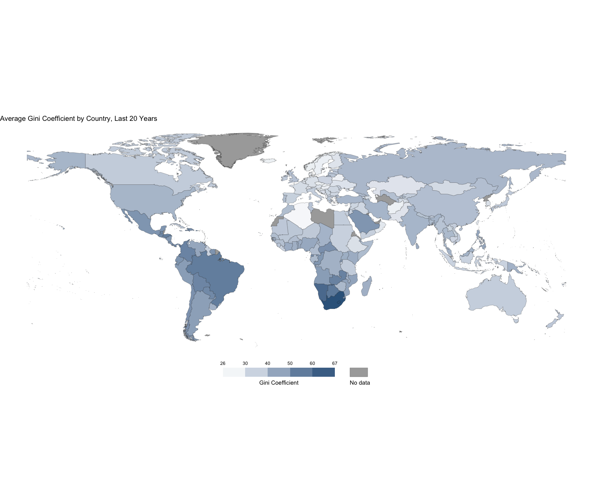
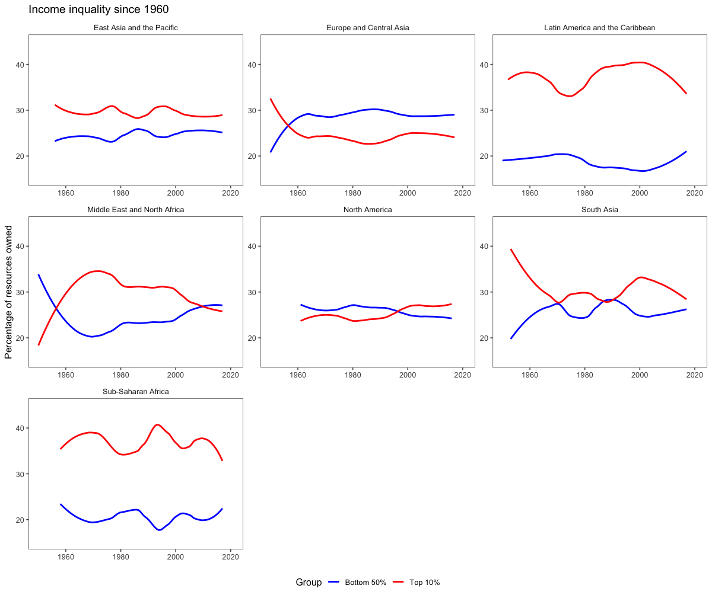
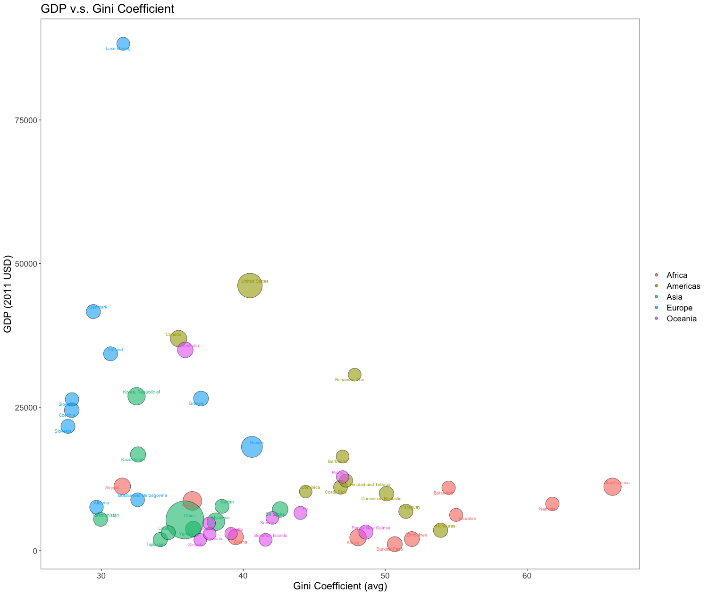
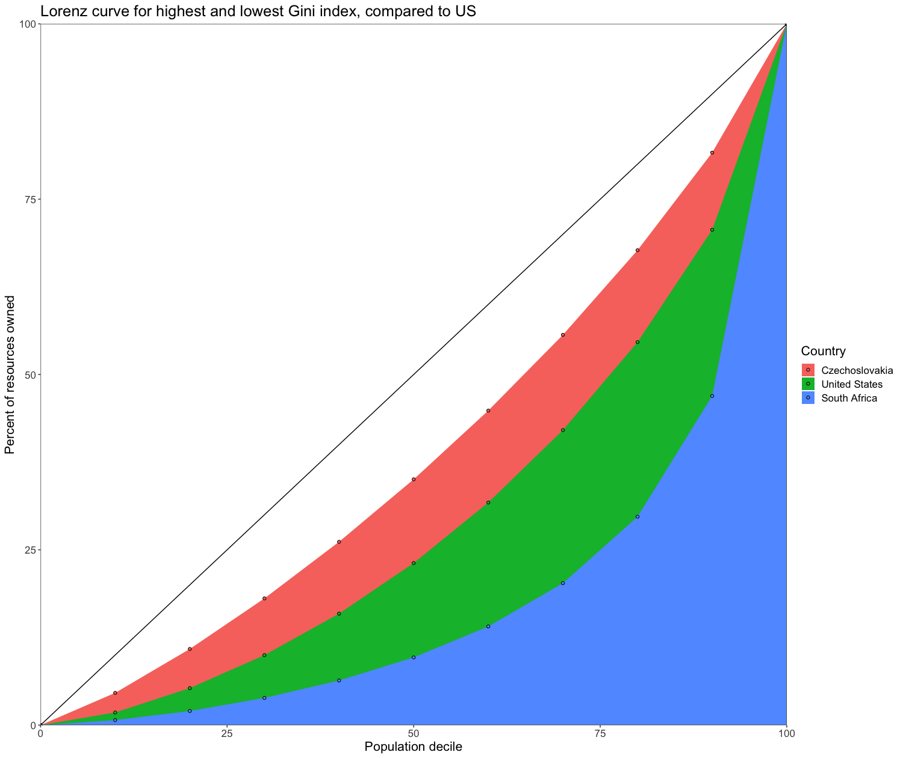
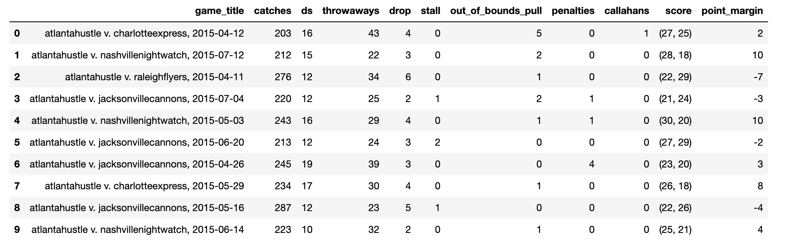
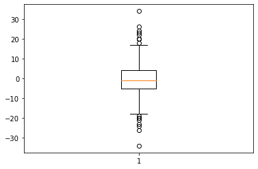

# Data Challenge - Megan Ren

## Part One

Transforming and visualizing the WIID (World Income Inequality Dataset) with RStudio, tidyverse. See [script](part_one/scripts/script_wiid.R).

### Visualization 1:


This is a heatmap of the world, with each country colored by its Gini coefficient (averaged from 2000 - onwards, for any years that have data). The visualization captures the dataset at its highest level — it allows us to see at a glance how severe is wealth inequality in a given country is. Certain countries stand out, but the map also highlights larger regions of relative inequality, such as  southern Africa and South America. Not all countries have data for every year between 2000-2020, but the average gets us a general picture of the last few decades. Note also that the WIID dataset provides quality metrics for each observation, but as this visualization is just to get a general picture of the main purpose of the dataset, we don’t count them for anything. 


### Visualization 2:


The WIID dataset also provides information on resource share by quintile and decile. Using this, we calculate the cumulative share of the bottom 50% of the population and the top 10%, and compare then for each region (as classified by the World Bank). This kind of detailed decile information allows us to visualize the patterns of wealth distribution on a more granular level than what the Gini coefficient as a simple summary statistic tells us. These graphs show the average values of resource share for the 50% and 10% groups, averaged across all observations (all countries) for a given year. We see both how inequality changes over time (increasing in North America, decreasing in south Asia, for example) and the magnitude of the inequality (high in Latin American and the Caribbean, for example). It’s worth nothing that tracking how closely the changes for each region mirror each other can tell us a lot about wealth distribution. We might infer that increases in the top 10% resource share in South Asia came at the expense of the resource share of the bottom 50%, whereas the dip in resource share in the late 1970s for Latin America doesn’t correspond with an equal magnitude rise in resource share for the 50% group, so the upper-middle class might have shrunk then. 


### Visualization 3:


This visualization leverages other data present in the dataset to provide insight on patterns related to income inequality. It plots the Gini coefficient of countries (randomly sampled from a region group) on the x axis with their GDP (in USD) on the y, and gives the point a size according to population. We also color the points by the UN classification of regions. This graph suggests some general trends around these variables — namely, that GDP has a weak negative correlation with Gini coefficient. We can also see which quadrant of the graph regions tends to sit, like how Europe is closer to the upper left than other regions. The graph also allows us to observe interesting outliers like Luxembourg and South Africa. 


### Visualization 4:


For the final visualization, I chose to return to the decile data — I found that these variables gave the most detailed, interesting information about income inequality. At first, I plotted the Lorenz curves for the average decile values of each UN region, but realized that they overlapped too closely to be discernable. Instead, we take the countries with the highest and lowest Gini coefficients (Czechoslovakia and South Africa, respectively) and plot the cumulative resource share of each decile. Obviously I’m making the assumption that we’re interested in some way in comparing the U.S. to the rest of the world, but being from the U.S. I feel like that’s a fair choice. We plot the deciles for the U.S. as well and can compare how close each wealth distribution is to perfect equality (the diagonal line with slope 1). 


## Part Two

Using Python to train a linear regression model on an Ultimate Frisbee [dataset](part_two/2015_event_data.csv). [Code here](part_two/ultimate_frisbee.ipynb), run in a Jupyter Notebook.

### Data 
I found an online dataset from [this project](https://github.com/karinehsu/cs109-final-project) about ultimate frisbee (my sport!). High quality data is hard to come by in this niche, so the dataset is not super clean and requires some transformation. It tracks the events of games in the 2015 AUDL (a pro ultimate league) season. It initially follows the format where each row is an action that happened in the game (for example, a row with relevant columns could look like [Game Date, Opponents, Score-Us, Score-Them, Action, Team]. An action can be one of many relevant things that happen in frisbee games - a catch, a “D” (where the defensive team intercepts or knocks the disc to the ground), a drop (the receiver drops the disc, making possession switch), etc. 

### Data transformation:
We’re interested in a dataset that can easily be used for training a model. The current format is not very conducive to this, so I transformed the data. In our new dataset, each row is a game played and includes the total stats of actions that happened to the team listed first in the game title. E.g in the first row of the photo below, Atlanta Hustle had 203 catches and dropped the disc 4 times in their game against Charlotte Express on 4/12/2015, and the final score of the game was Atlanta: 27 - Charlotte: 25. 



### Quantitative description: 
Some basic summary statistics of the data are below. We can explore the data to see how many of each event happens in the average AUDL game, or look at a box and whiskers plot of the point margin of games. Or we could look at which team won the most games in the season (Toronto Rush, at 14 wins). There’s more information in the Jupyter notebook on quantitative descriptions and general data exploration. 

```
average point differential per game: 6.545454545454546
total games played in the 2015 season: 176.0
average catches per game: 237.5653409090909
average d's per game: 12.633522727272727
average drops per game: 4.463068181818182
max number of penalties in a game: 4 
```



### Model: 
The model I decided to train is a linear regression model. Given a description of the team’s actions during a game(e.g. how many catches? how many drops?), can we predict the outcome of the match? Put more precisely, we take the number of “relevant actions” that a team records during a game and try to predict the point margin of the final score. We define relevant actions as a subset of all possible actions, listed below, that are likely to have a correlation with the performance of a team, while not being directly correlated with the final score (the number of “goal” actions in a game would be perfectly correlated, for example). Based on my prior domain knowledge of ultimate, I picked catches, throwaways, Ds, drops, and stalls as potentially relevant features for measuring a team’s overall ability. Catches imply offensive skill, while Ds imply defensive skill. Drops should be relatively rare at a professional level of playing, and their presence might indicate a less polished team with weaker individual players. A stall means that the thrower didn’t throw the disc within 10 seconds, implying that the other team played exceptionally strong defense — these should also be pretty infrequent. 

```
List of all actions: ['Catch',  'Goal',  'Throwaway',  'Pull',  'D',  'OpponentCatch',  'Drop',  'PullOb',  'EndOfFirstQuarter',  'Halftime',  'EndOfThirdQuarter',  'GameOver',  'OpponentPull',  'Stall',  'MiscPenalty',  'OpponentPullOb',  'EndOfFourthQuarter',  'Callahan',  'EndOfOvertime']
```

To actually perform the regression, we first min-max normalize our data to account for the variation in frequency of different events. We then split our dataset 80/20 train/test and train our linear model. Analyzing the results - we have a mean squared error of 33.5 for the particular run I’m exploring, although it depends on the random split of training and test data. Our mean absolute error is around 4.6 (lower than the square root of 33.5), giving us a sense that we have some outliers in our test data. We can interpret the MAE as the model having around a 5-point error on the difference in scores at the end of a game. This might seem high, but considering the range that most score differentials fall in (IQR = 9, overall range is ~60), our model isn’t doing too bad. If we graph the predicted value of the point margin v.s. the actual value, we can also see that they correlate pretty well. 


Lastly, our Pearson correlation coefficient is in the range of 0.62, implying a fairly strong relationship our predicted and actual values — as the actual value of the point margin increases, so does our predicted value. Note though that this value changes (fluctuating from ~0.5-0.8) as the random sorting of data points into test and training sets changes, since our dataset is relatively small. 

We can identify outliers by taking the max difference between predicted and actual point margins. Diving into the data for one particular outlier, we see that this was a game between Toronto Rush and the Rochester Dragons, with a final score of 27-10 Toronto for an actual point margin of 17, but a predicted point margin of -11. The number of drops is unusually high for a game, at least 20 for both teams, while the average for a game is around 4. This, along with the number of throwaways, suggests bad weather conditions (frisbee is really hard when it’s windy), and a cursory Google search reveals that there was a storm in the region where the game would have been played that day. Our model can’t take into account things that affect both teams, it just sees the high number of drops from Toronto and assumes a negative point margin - we could adjust for this by including the opponent’s statistics for a game as well, but to simplify, I’m just using the first team’s counts. 


### Assumptions:
There are some inconsistencies in the data, mostly typos in how an event is recorded (i.e. a game opponent that is recorded as “Indianapolis AlleyCays” instead of “Indianapolis Alleycats”). Given that there are on the order of ~10 occurrences from the original dataset that we can’t resolve (out of ~350 total games), we drop them and assume that their distribution is representative of the data; i.e. there is no correlation between “unclean” rows and anything else. We can confirm this by noting that there are no teams that are consistently misspelled. Instead, these recording errors seem to be completely random. 

Another baseline assumption is that all events in a game are recorded accurately — there’s no bias in whether teams only record positive events, or record differentially based on their opponents, etc. 

I also assumed that the chosen actions (catches, drops, etc) are uncorrelated enough with the score margin to make this task interesting. If we were to include goals in our actions, then the task immediately becomes trivial, so in thinking about how ultimate is played, I assumed that actions that happen during a point predict the quality of the team, not the outcome of the game directly. This seems fair — for instance, some points may take 2 throws to win, or others might take 20, but along with the other actions tracked like interceptions (Ds) or drops, we can learn something about a team’s performance in general. 


